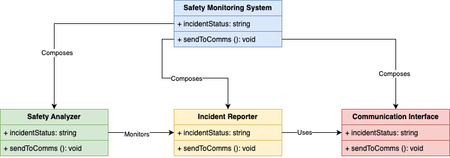
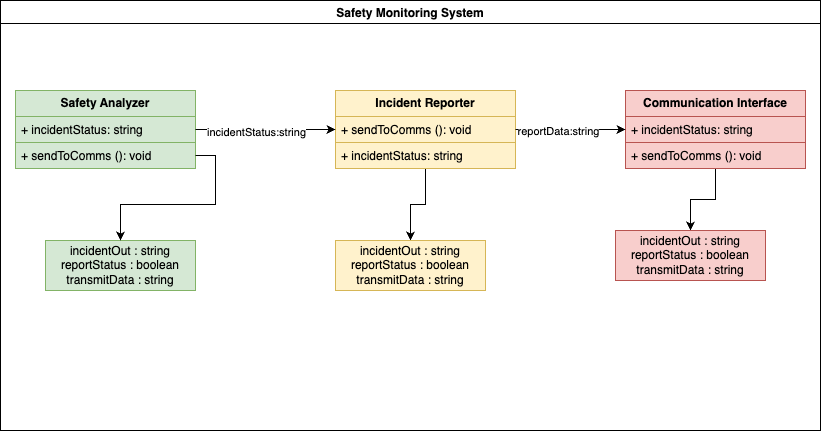

# MBSE Modeling Portfolio – Safety Monitoring System

This repository showcases a model-based engineering example using SysML-inspired diagrams. The system modeled is a **Safety Monitoring System** used to detect, analyze, report, and communicate safety-critical incidents.

---

## ✅ MBSE Day 1 – Block Definition Diagram (BDD)

### 🧭 Overview

This Block Definition Diagram (BDD) models the system structure, showing how major components are composed and related.

### 📦 Modeled Blocks

#### `Safety Monitoring System`
- Composes all major subsystems.

#### `Safety Analyzer`
- Detects anomalies and generates incident data.

#### `Incident Reporter`
- Logs and prepares incident data for transmission.

#### `Communication Interface`
- Sends reports externally.

### 🔗 Relationships

- `Safety Monitoring System` **composes** all components.
- `Safety Analyzer` **monitors** `Incident Reporter`.
- `Incident Reporter` **uses** `Communication Interface`.

---

## 🔁 MBSE Day 2 – Internal Block Diagram (IBD)

### 🧭 Overview

This Internal Block Diagram (IBD) shows how components interact via ports and data flow within the `Safety Monitoring System`.

### 🔧 Ports & Connectors

Each block exposes ports that represent:

- `incidentOut : string`
- `reportStatus : boolean`
- `transmitData : string`

### 🔁 Data Flow

- `Safety Analyzer` ➝ `Incident Reporter`: `incidentStatus : string`
- `Incident Reporter` ➝ `Communication Interface`: `reportData : string`

---

## 📘 MBSE Concepts Demonstrated

- Block Definition Diagram (BDD)
- Internal Block Diagram (IBD)
- System decomposition & composition
- Ports and connectors
- Value types and flow properties

---

## 🎯 About

Created by **Sean Mayers**  
🧠 Background: NASA/DoD System & Software Safety  
🎯 Goal: Transition into high-impact MBSE/System Architect roles

> ✅ This is part of Sean’s ongoing MBSE portfolio to prepare for roles in aerospace, defense, and intelligent systems.
